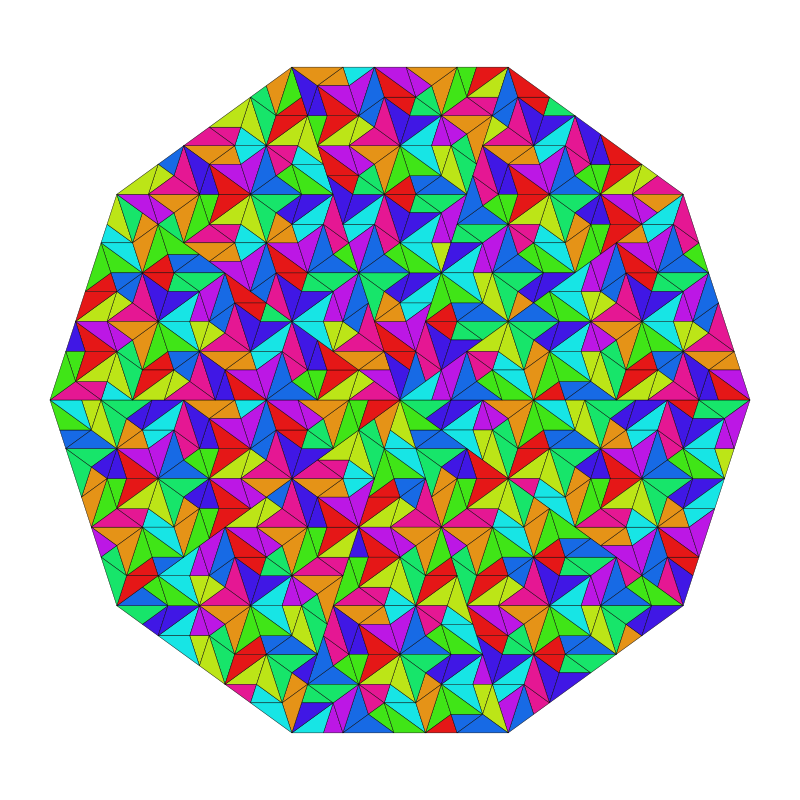

# Penrose Tiling Generator

-----

## 📚 Historical Background

**Penrose tilings** are non-periodic tilings discovered by mathematician and physicist **Sir Roger Penrose** in the 1970s. Unlike regular tilings (like square or hexagonal grids), Penrose tilings **never repeat** in a translational sense but exhibit **local fivefold rotational symmetry** and **quasiperiodic order**.

Penrose developed different types of tilings, with **kite and dart** tiling being one of the earliest and most visually iconic forms.

These tilings became important in **mathematics**, **physics**, and **crystallography** (e.g., explaining structures of quasicrystals), and were also a major influence in **art** (e.g., M.C. Escher's later work).

> 📖 Reference:
> R. Penrose, "Pentaplexity: A class of non-periodic tilings of the plane", *The Mathematical Intelligencer*, 1979.
> DOI: [10.1007/BF03026814](https://doi.org/10.1007/BF03024384)

-----

## 📐 Triangle-Based Subdivision Tiling

This version of the program generates Penrose tilings using **iterative subdivision** of **acute (thin)** and **obtuse (thick)** golden triangles based on Penrose’s and Robinson’s substitution rules. It is mathematically equivalent to recursive implementations, but uses an iterative stack-based approach to avoid Python recursion limits.

### Key Characteristics

* **Fixed Initial Pattern:** Uses a symmetrical 10-triangle star (decagonal) as the seed.
* **Triangle-Based Only:** All tiles are golden triangles — either acute or obtuse.
* **Iterative Subdivision:** Substitution rules are applied using a controlled iteration stack (avoiding recursion depth errors).
* **Implicit Matching Rules:** No decorative arcs needed — aperiodicity and matching logic are encoded in the subdivision rules themselves.

> 🔁 **Note:**  
> While Penrose triangle tilings are defined recursively, this implementation uses a stack to simulate recursion.  
> This method is widely used in computational geometry and does **not alter the mathematical correctness** of the tiling.

-----

### 🎨 Features

* **Color Modes:**
  * `mono`: Grayscale mode (all triangles the same).
  * `type`: Colors based on triangle type (acute or obtuse).
  * `color`: Colors based on triangle orientation (reveals 5-fold symmetry).
* **Recursion Depth Control:** Set recursion depth (3–6 recommended).
* **Export Options:** Save the resulting tiling as `.png` or `.svg`.

### Usage  

Upon running, you’ll be prompted to:  

1. Enter recursion depth (e.g., 4).  
2. Select a color mode (`mono`/`type`/`color`).  
3. Optionally save the output (e.g., `tiling.png`). 

📝 This version offers a cleaner geometric representation and is particularly useful for studying the underlying substitution logic of Penrose tilings without the visual clutter of explicit matching rule enforcement.
